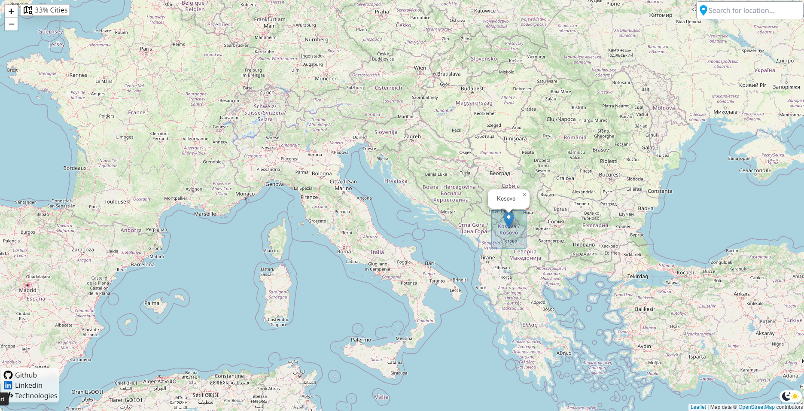
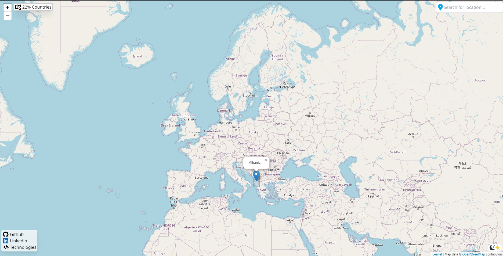
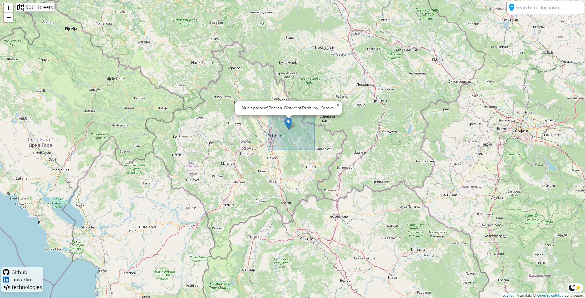

# Map Viewer

This project is a simple map viewer that allows you to select a location on the map or search for a location and view its bounding box. It uses the OpenStreetMap API to retrieve the map data and bounding box information.

## Technologies Used

- [Tailwind CSS](https://tailwindcss.com/)
- [Figma](https://www.figma.com/)
- [Alpine.js](https://github.com/alpinejs/alpine)
- [Leaflet](https://leafletjs.com/)
- [OpenStreetMap](https://www.openstreetmap.org/)

## Installation

1. Clone the repository to your local machine.
2. Install the dependencies by running `npm install`.
3. Start the development server by running `npm run start`.
4. To build Tailwind CSS, you can run the command `npm run build`.

## Usage

Once the development server is running, you can use the map viewer by following these steps:

1. Click on the map to select a location.
2. Use the search bar to search for a location by name.
3. The bounding box for the selected or searched location will be displayed on the screen.

## Preview

Here are some screenshots of the application in action:

## Future work
- [ ] Add functionality to get the current location using the browser API.
- [x] Implement image preview for markdown README.md

## License

This project is licensed under the MIT License.

